# 🔐 Network Scanner Lab (VMware Cybersecurity Project)

## 📌 Project Overview

This project demonstrates a complete cybersecurity workflow including network scanning, web enumeration, system hardening, and validation using a VMware lab environment.

The objective is to identify exposed services, assess potential vulnerabilities, apply security improvements, and verify the effectiveness of those measures.

---

## 🖥️ Lab Setup

- **Attacker Machine:** Kali Linux  
- **Target Machine:** Ubuntu Desktop  
- **Platform:** VMware Workstation  
- **Network Type:** Host-only (isolated lab)  

---

## 🌐 Network Configuration

- Kali Linux IP: 192.168.38.131  
- Target IP: 192.168.38.129  

Both systems are connected within the same internal network.

---

## 🔧 Tools Used

- Nmap  
- WhatWeb  
- Nikto  
- Gobuster  
- Apache2  
- UFW (Firewall)  
- Kali Linux  

---

# 🔍 Phase 1: Network Scanning

## 🧠 Objective
Identify active hosts, open ports, and running services.

## 🛠️ Actions Performed
- Verified connectivity using `ping`
- Performed Nmap scan
- Used `-sC -sV` for service detection

## 📊 Results
- Port **80 (HTTP)** is open  
- Service: **Apache HTTP Server 2.4.58 (Ubuntu)**  

## 📸 Screenshots

### Ping Test

### Nmap Scan

### Advanced Scan (-sC -sV)
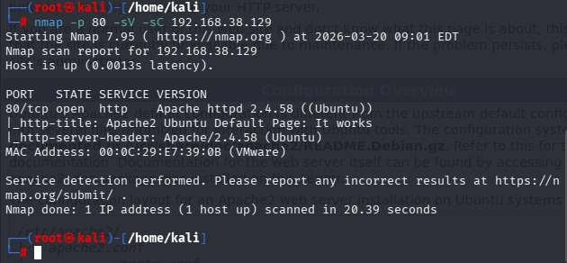

### Apache Default Page

---

# 🔍 Phase 2: Web Enumeration

## 🧠 Objective
Analyze the discovered web service for vulnerabilities and hidden resources.

## 🛠️ Tools Used
- WhatWeb  
- Nikto  
- Gobuster  

## 🔎 Findings

- Apache version information exposed  
- Default Apache page accessible  
- Missing security headers (X-Frame-Options, X-Content-Type-Options)  
- Potential information leakage via ETags  
- Presence of default and restricted directories  

## 📸 Screenshots

### WhatWeb Scan
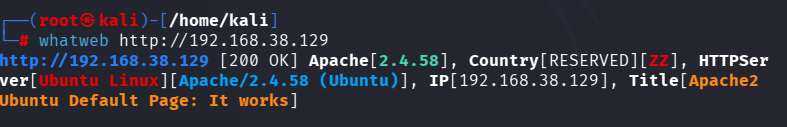

### Nikto Scan
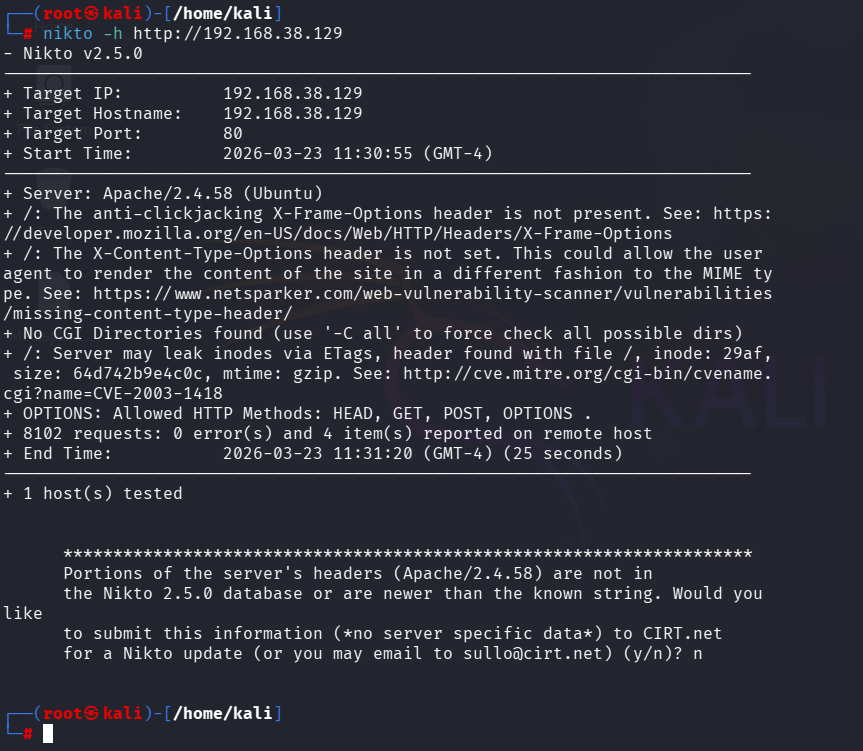

### Gobuster Scan
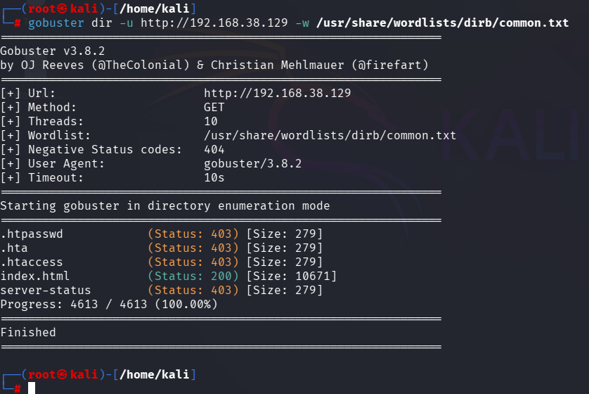

---

# 🔐 Phase 3: System Hardening

## 🧠 Objective
Reduce attack surface and improve system security.

## 🛠️ Actions Performed

### 1. Apache Hardening
- Disabled version disclosure:
  - `ServerTokens Prod`
  - `ServerSignature Off`

### 2. Removed Default Page
- Deleted `/var/www/html/index.html`

### 3. Firewall Configuration
- Enabled UFW
- Allowed only:
  - Port 22 (SSH)
  - Port 80 (HTTP)

### 4. System Update
- Updated system packages to patch vulnerabilities

## 📸 Screenshots

### Apache Config (Before)

### Apache Config (After)

### Remove Default Page (Verification)
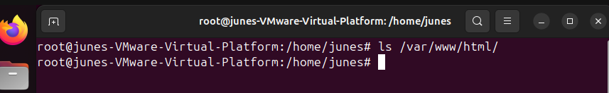

### Remove Default Page (Result)
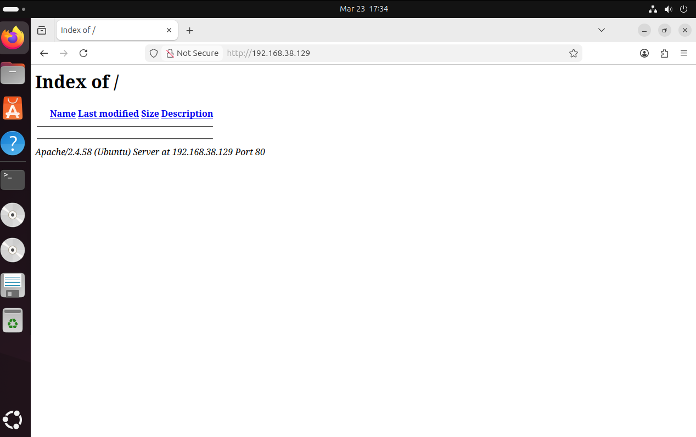

### UFW Enable
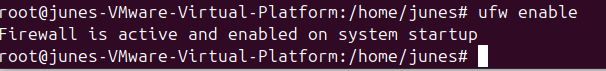

### UFW Rules
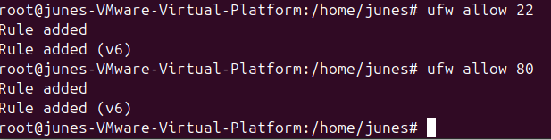

### UFW Status

---

# 🔁 Phase 4: Re-Scan & Validation

## 🧠 Objective
Verify that the applied security measures improved the system’s security posture.

## 🛠️ Actions Performed
- Re-ran Nmap scan using `-Pn` (host discovery blocked by firewall)
- Performed Nikto vulnerability scan
- Checked HTTP headers using curl

## 📊 Results

After hardening:

- Apache version information is no longer exposed  
- Default Apache page has been removed  
- Firewall prevents host discovery (ICMP blocked)  
- Reduced information disclosure  

This confirms that the system is more secure than during the initial assessment.

## 📸 Screenshots

### Nmap After Hardening
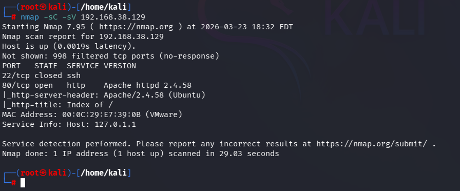

### Nikto After Hardening
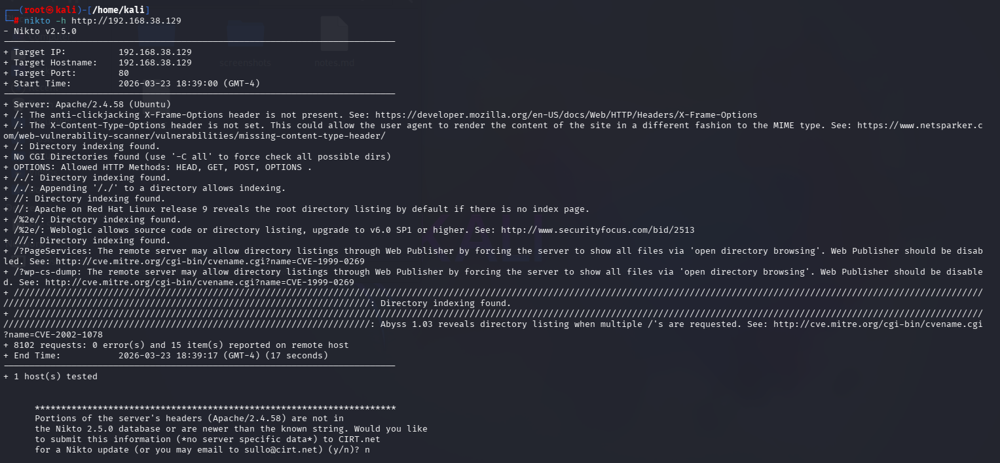

### Headers After Hardening
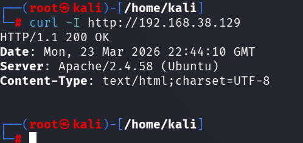

---

# 📊 Overall Analysis

The initial assessment revealed multiple weaknesses, including information disclosure, default configurations, and lack of security controls.

After applying hardening techniques:
- Sensitive information exposure was minimized  
- Default configurations were removed  
- Network access was restricted  
- Overall security posture significantly improved  

---

# 📚 What I Learned

- Network scanning and service detection using Nmap  
- Web enumeration techniques and tools  
- Identifying vulnerabilities and misconfigurations  
- System hardening and defensive security practices  
- Importance of validation after security changes  

---

# ⚠️ Disclaimer

This project was conducted in a controlled virtual lab environment for educational purposes only.
