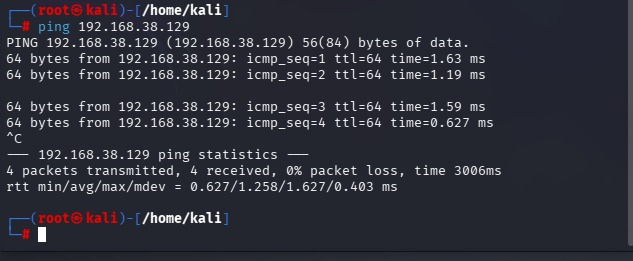
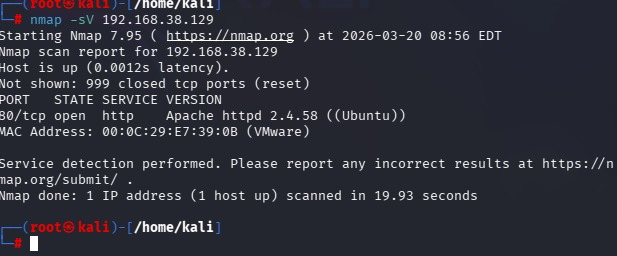
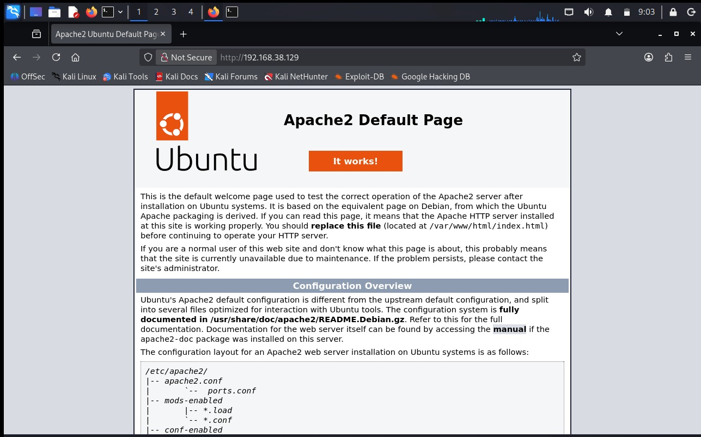

# 🔐 Network Scanner Lab (VMware Cybersecurity Project)

## 📌 Project Overview

This project demonstrates basic network scanning and service detection using Kali Linux and Nmap in a VMware lab environment.

The objective is to identify open ports, detect running services, and understand potential attack surfaces.

---

## 🖥️ Lab Setup

- **Attacker Machine:** Kali Linux
- **Target Machine:** Ubuntu Desktop
- **Platform:** VMware Workstation
- **Network Type:** Host-only (isolated network)

---

## 🌐 Network Configuration

- Kali Linux IP: 192.168.38.131
- Target IP: 192.168.38.129

Both machines are connected to the same internal network.

---

## 🔧 Tools Used

- Nmap
- Kali Linux
- Apache2 (on target)
- VMware Workstation

---

## 🔍 Methodology

1. Verified connectivity using `ping`
2. Performed initial scan using Nmap
3. Identified open ports and services
4. Ran advanced scan using `-sC -sV`
5. Accessed the web service through a browser
6. Documented findings

---

## 📊 Results

The Nmap scan revealed:

- **Port 80 (HTTP)** — Open
- **Service:** Apache HTTP Server 2.4.58 (Ubuntu)

The Apache default page was successfully accessed from the Kali machine, confirming that the service is reachable.

---

## 🔍 Analysis

The presence of an open HTTP port indicates that the target system is running a web server.

Exposed services increase the attack surface and may be vulnerable to:
- Web application attacks
- Misconfigurations
- Outdated software

Even a default Apache configuration can reveal useful information to an attacker.

---

## 📸 Screenshots

### Ping Test

### Nmap Scan

### Advanced Scan (-sC -sV)

### Apache Web Page

---

## 📚 What I Learned

- How to set up a cybersecurity lab in VMware
- Basics of network scanning with Nmap
- How to identify open ports and services
- Understanding attack surfaces
- Importance of service exposure

---

## ⚠️ Disclaimer

This project was conducted in a controlled virtual lab environment for educational purposes only.
